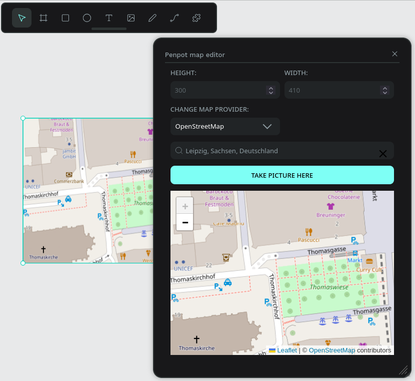

# Penpot map editor plugin

**Make your penpot designs more impressive by adding hand-crafted 2D maps!** 

The map editor plugin allows designers to search for places, to adjust the width, height and zoom of the map and to export it as image directly into your document.

By default, this plugin uses [OSM](https://www.openstreetmap.org/) tile layers and [Nominatim](https://nominatim.openstreetmap.org/ui/search.html) for searching places. More themes can be picked after adding a (free) [thunderforest API key](https://www.thunderforest.com/).



This plugin was set up with [Penpot Plugin Starter Template](https://github.com/penpot/penpot-plugin-starter-template).

## Usage

To enable this plugin in your penpot instance:

1. **Open the Plugin Manager:** Use the shortcut `Ctrl + Alt + P` in any file to open the Plugin Manager modal.

2. **Enter the manifest URL:** In the Plugin Manager, provide the plugin URL: *https://penpot-map-editor.netlify.app/manifest.json*

3. **Click "Install"**

4. **Access the plugin:** Once installed, you can open and use the plugin directly from within Penpot whenever you need it.

Enjoy :)


## Installation & local development

(Taken from Penpot Plugin Starter Template:)

### Install Dependencies

After cloning the repository, navigate into the project directory and install the necessary dependencies by running:

```bash
npm install
```

This command installs all the required packages listed in the `package.json` file.

### Run the Development Server

To start the development server, run the following command in your terminal:

```bash
npm run dev
```

Once the server is running, open your web browser and go to `http://localhost:4400` to view your plugin in action. Now it is ready to be loaded in Penpot with the url `http://localhost:4400/manifest.json`.

### Load your local plugin

To load and test your local plugin running on `http://localhost:4400`, follow these steps:

1. **Open the Plugin Manager:** Use the shortcut `Ctrl + Alt + P` in any file to open the Plugin Manager modal.

2. **Enter the manifest URL:** In the Plugin Manager, provide the URL for your local plugin's manifest file. For a local setup, this URL will be: `http://localhost:4400/manifest.json`.

3. **Install the plugin:** After entering the URL, Penpot will attempt to install the plugin. If there are no issues, the plugin will be successfully installed.

4. **Access the plugin:** Once installed, you can open and use the plugin directly from within Penpot whenever you need it.

## Development

### Technologies Used

This plugin template uses several key technologies:

- **TypeScript**
- **Vite**
- **Web Components**

### Libraries Included

The template includes two Penpot libraries to assist in your development:

- `@penpot/plugin-styles`: <a href="https://www.npmjs.com/package/@penpot/plugin-styles" target="_blank">This library</a> provides utility functions and resources to help you style your components consistently with Penpot's design system.
- `@penpot/plugin-types`: <a href="https://www.npmjs.com/package/@penpot/plugin-types" target="_blank">This library</a> includes types and API descriptions for interacting with the Penpot plugin API, facilitating the development of plugins that can communicate effectively with the Penpot app.

## Deployment

### Build your plugin

```bash
npm run build
```

### Deploy your plugin

After successfully building your plugin, now you're ready to use your chosen platform to deploy it.

Check our <a href="https://help.penpot.app/plugins/deployment/" target="_blank">Deployment guide</a> for more information about how to deploy your plugin in multiple platforms.
